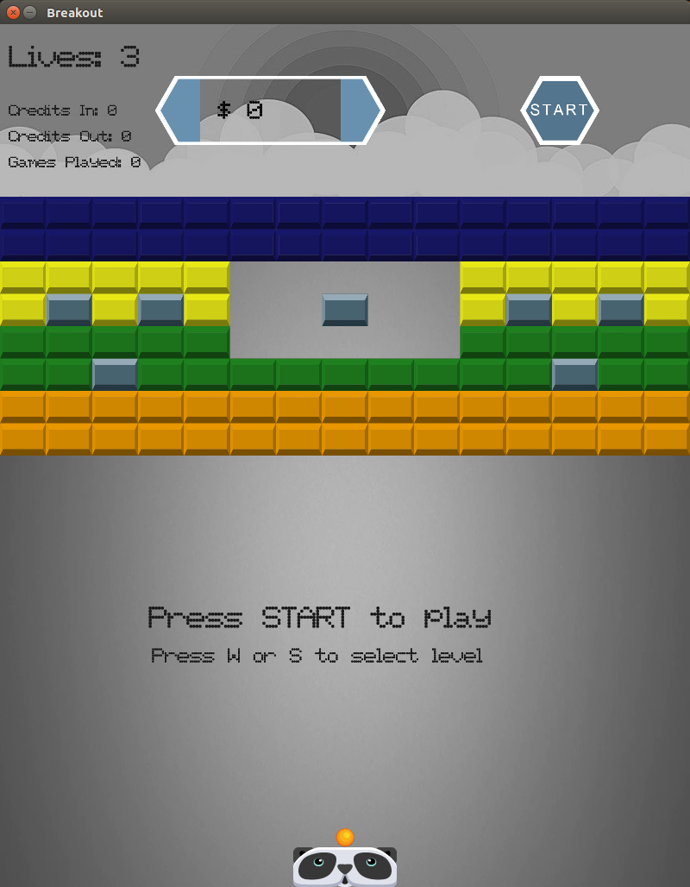

## C++/OpenGL

Project influenced by [this tutorial](http://www.learnopengl.com/#!In-Practice/2D-Game/Breakout) written by Joey de Vries.

#### Game Screen:

### Build
Dependencies can be found in  as submodules and can be downloaded to build the project.

Tested on Linux and windows.
